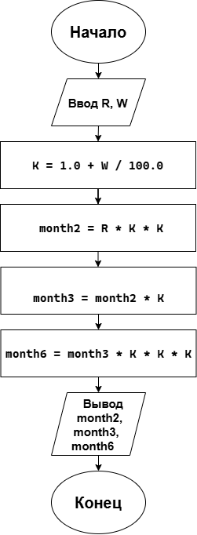

# Домашнее задание к работе 2
## Условие задачи
Клиент внес в банк R рублей. Каждый месяц эта сумма увеличивается на W процентов. Сколько будет у клиента денег через два месяца, три месяца, через полгода?
## 1. Алгоритм и блок-схема
### Алгоритм решения
1. Начало
2. Объявить константы:
   - начальная сумма вклада: R = 150000.0
   - ежемесячный процент: W = 5.0;
3. Вычислить коэффициент увеличения:
   - K = 1.0 + W / 100.0
4. Вычислить сумму через 2 месяца:
   - month2 = R * K * K
5. Вычислить сумму через 3 месяца:
   - month3 = month2 * K
6. Вычислить сумму через 6 месяцев:
    - month6 = month3 * K * K * K
7. Вывести результаты расчетов с подстановкой всех значений в текст
8. Конец
### Блок-схема

## 2. Реализация программы
```
#include <stdio.h>
#include <locale.h>

int bank()
{
	setlocale(LC_CTYPE, "RUS");

	double R = 150000.0;
	double W = 5.0;
	double K = 1.0 + W / 100.0;

	double month2 = R * K * K;
	double month3 = month2 * K;
	double month6 = month3 * K * K * K;

	printf("=============================================================\n");
	printf("ФИНАНСОВЫЙ ОТЧЕТ\n");
	printf("=============================================================\n");
	printf("Условие задачи:\n");
	printf("Клиент внес в банк %.2f рублей.\n", R);
	printf("Каждый месяц эта сумма увеличивается на %.1f процентов.\n\n", W);
	printf("Результаты расчетов:\n");
	printf("Через 2 месяца сумма составит %10.2f рублей.\n", month2);
	printf("Через 3 месяца сумма составит %10.2f рублей.\n", month3);
	printf("Через 6 месяцев сумма составит %10.2f рублей.\n", month6);
	printf("=============================================================\n");
}

int main()
{
	bank();
	getchar();
	return 0;
}
```
## 3. Результат работы программы
```
=============================================================
ФИНАНСОВЫЙ ОТЧЕТ
=============================================================
Условие задачи:
Клиент внес в банк 150000.00 рублей.
Каждый месяц эта сумма увеличивается на 5.0 процентов.

Результаты расчетов:
Через 2 месяца сумма составит  165375.00 рублей.
Через 3 месяца сумма составит  173643.75 рублей.
Через 6 месяцев сумма составит  201014.35 рублей.
=============================================================
```
## 4. Информация о разработчике
**Холодова Елизавета Юрьевна бИЦТ-262**
